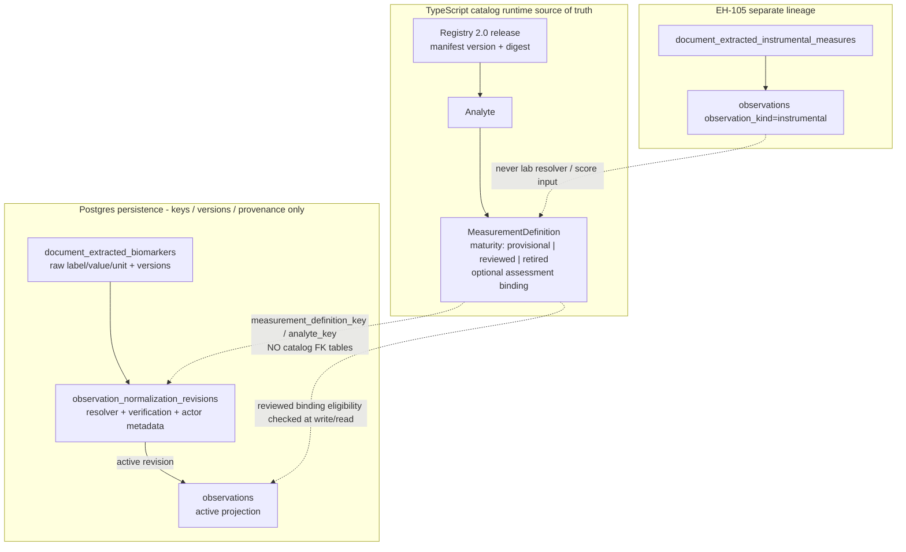

## Context

EH-102…EH-107 already shipped the pre-launch Registry 2.0 model, provenance,
EH-104 Phase A/B enforcement, instrumental lineage, hard cutover writers, the
44-row candidate corpus, and CBC antipair fixtures. GitHub issues #1–#7 are
closed on `master`. EH-108 is the documentation and cutover-hygiene closeout
for issue #8.

Current gaps:

1. No canonical ADR consolidates why EasyHealth rejected dual runtime.
2. Ops knowledge is scattered across EH-104/105/106 runbooks and
   `registry/candidate-release/v1/reset-rollback.md`.
3. `registry/measurement-registry-rollout.md` still documents
   `off/shadow/promote` and flag rollback to v1.
4. `.github/workflows/measurement-registry.yml` pushes on `main`, while the
   default branch is `master`, so tip-SHA post-merge CI evidence is missing.
5. Phase B operator docs imply disposable reset before migration 034, but the
   reset RPC is created by 034.
6. Default catalog changelog still says “Registry 2.1”.

Constraints:

- Do not restore `/docs/` in this change (#75 remains separate; `/docs/` is
  gitignored).
- Keep ADR substantive and stable; keep the launch checklist purely
  procedural.
- Capture CI evidence on the final post-EH-108 `master` SHA, not baseline
  `291087a`.
- Do not build a new `033 + dirty` harness, redesign approvals, mass-sync
  roadmap JSON, or start EH-109…EH-120.

## Goals / Non-Goals

**Goals:**

- Publish one stable ADR that a tech lead can defend at launch review.
- Publish one procedural Fresh/Retained launch checklist an engineer can
  execute without reading OpenSpec history.
- Make registry docs discoverable via `registry/README.md`.
- Remove active shadow/dual-runtime instructions.
- Make Measurement Registry CI listen to `master` and support manual dispatch.
- Document a non-circular reset/deploy path.
- Align the catalog changelog label with Architecture Registry 2.0.
- Provide `QA/eh-108` acceptance evidence for explain / run / interpret.

**Non-Goals:**

- No new `033 + dirty` automated DB harness.
- No approvals schema redesign (role fixtures remain EH-106 evidence).
- No mass roadmap JSON / issue metadata archaeology beyond what ADR needs.
- No `/docs` tree repair.
- No EH-109 resolver scoring, EH-110 alias provenance, EH-111 unit/specimen
  rules, EH-112 incomplete UX, EH-115 decision trace, EH-116 reprocessing, or
  EH-120 verification workflow activation.

## Decisions

### 1. Documentation home is `registry/`, not `/docs`

**Decision:** Put ADR, index, launch checklist, and the superseded rollout stub
under `registry/`. Put acceptance under `QA/eh-108/`.

**Why:** `/docs/` is gitignored and broken (#75). `registry/` already owns the
candidate package, v1 audit fixture, and reset notes.

**Rejected:** Restoring the full docs tree inside EH-108.

### 2. ADR is substantive; checklist is procedural only

**Decision:**

- ADR holds decision, rejected alternatives, Mermaid schema/ownership,
  maturity × resolver matrix, version axes, ownership, consequences, and
  non-goals.
- Launch checklist holds only ordered Fresh/Retained steps, commands, smoke
  checks, evidence blanks, and forward-only rollback steps.

**Why:** Stable policy should not churn when CI command names move; ops steps
should not bury architecture rationale.

### 3. Required Mermaid schema / ownership model

ADR MUST include a Mermaid diagram for logical + physical ownership. Do not
duplicate it as ASCII.

Interpretation rules encoded by the diagram:

- Catalog entities live in TypeScript (`src/lib/biomarkers/*`).
- DB stores keys, version integers/strings, digests, raw evidence, and
  revision/projection rows.
- There are no launch-time catalog FK tables from observations to analyte /
  definition rows.
- Instrumental observations are a separate source path and are not Registry
  laboratory resolver/score inputs.

### 4. Dependency and evidence ownership

| Item | Owner for EH-108 text |
| --- | --- |
| Direct dependency | EH-104 (promotion primitive + Phase B enforcement) in addition to EH-102/103/105/106 |
| Corpus / manifest / approvals | EH-106 candidate-release package |
| CBC antipair evidence | EH-107 suite (separate from 44-row corpus) |
| CI proof SHA | Final merged EH-108 `master` commit, not `291087a` |

### 5. Fresh vs Retained remain separate scenarios

**Fresh / disposable**

1. Stop traffic/jobs.
2. `supabase db reset` (applies 001–034). Do **not** call Phase B reset RPC
   first.
3. Deploy web + worker.
4. `pnpm preflight:eh104` clean.
5. Smoke + capture evidence.

**Retained / persistent**

1. Deploy EH-106-compatible app/worker first.
2. Stop workers.
3. `pnpm preflight:eh104`.
4. Dirty → ABORT (no destructive reset, no forced 034 apply).
5. Clean → apply/verify 034.
6. Smoke + capture evidence.

`pnpm reset:eh104-phase-b` is allowed only after 034 exists, only with
`EH104_PHASE_B_DISPOSABLE=1` and `EH104_PHASE_B_ALLOW_RESET=1`, and only on an
explicitly disposable environment.

### 6. In-scope hygiene patches

Included in EH-108 implementation (later apply phase):

1. CI workflow push branches: `main` → `master`; add `workflow_dispatch`.
2. Rewrite circular reset guidance in Phase B operator docs / checklist.
3. Supersede `measurement-registry-rollout.md`.
4. Change default changelog `"Registry 2.1 measurement governance baseline"` →
   `"Registry 2.0 measurement governance baseline"`.

### 7. Explicitly deferred

- New automated DB test that boots at 033 with dirty fixtures.
- Real human approver identity / evidence URL redesign.
- Roadmap JSON bulk sync.
- Anything in EH-109…EH-120.

## Risks / Trade-offs

- **[Docs claim a cutover that CI cannot prove on master]** → Fix workflow
  trigger in the same change and record final SHA run URLs in QA/eh-108.
- **[Operator follows Phase B reset before 034 and fails]** → Checklist and
  runbook must state Fresh=`db reset`; reset RPC only post-034/disposable.
- **[ADR duplicates EH-106 design and drifts]** → ADR cites EH-106/107
  artifacts; does not rewrite corpus semantics.
- **[Engineer still finds shadow-mode docs]** → Supersede stub must be the
  only remaining rollout entry and must ban shadow/promote language.
- **[Scope creeps into harness/approvals work]** → Non-goals and tasks keep
  those items out.

## Migration Plan

1. Fill OpenSpec artifacts (this change) and validate `--strict`.
2. On apply: add registry ADR/index/checklist, QA/eh-108, supersede rollout,
   patch CI + reset docs + changelog string.
3. Merge to `master`.
4. Confirm Measurement Registry workflow ran on the merge SHA (or dispatch).
5. Record verify + database run URLs, catalog digest, and candidate
   input/manifest/report hashes in `QA/eh-108/checklist.md`.
6. Close GitHub #8 after acceptance walkthrough.

Rollback for docs/hygiene is a forward doc/CI fix. Product rollback remains
forward-only Registry 2.0; never restore v1 runtime.

## Open Questions

None blocking for planning. Assumed:

- Default branch remains `master`.
- Candidate package path remains `registry/candidate-release/v1/`.
- Phase B runbook path remains the archived EH-104 Phase B implementation
  runbook plus any live operator pointers updated by this change.
