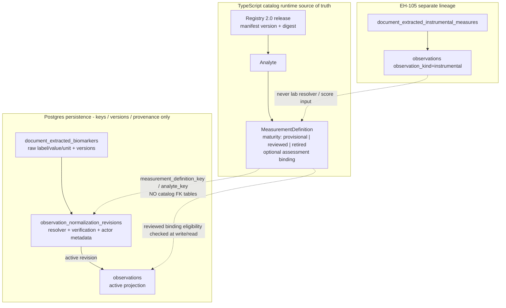

# ADR 0001: Registry 2.0 hard cutover

- **Status:** Accepted
- **Date:** 2026-07-23
- **Roadmap:** [EH-108](https://github.com/Hazyshades/EasyHealth/issues/8)
- **Direct dependencies:** EH-102, EH-103, **EH-104**, EH-105, EH-106
- **Evidence inputs:** EH-106 candidate corpus/manifest/approvals; EH-107 CBC suite

## Context

EasyHealth is pre-launch. Registry v1 contained useful aliases, units, and
assessment metadata, but keeping a dual Registry v1/v2 runtime would create two
identities, two acceptance paths, and a feature-flag rollback that reintroduces
an unsupported contract. EH-102…EH-107 already migrated knowledge into Registry
2.0, cut over writers and consumers, and added launch evidence. This ADR records
the durable decision and ownership model those changes implemented.

## Decision

EasyHealth uses **one pre-launch Registry 2.0 runtime** for laboratory semantic
identity.

- Frozen Registry v1 artifacts remain audit/migration fixtures only.
- Application, worker, API, UI, assessment, and normal runtime scripts MUST NOT
  import Registry v1 or restore dual-read / shadow / promote feature flags.
- Incomplete mappings remain visible as raw evidence; the system MUST NOT invent
  concrete specimen, definition, conversion, trend, or score inputs.
- Product rollback is **forward-only** within Registry 2.0 (stop writers/jobs,
  fix definitions or code, reprocess or reset disposable environments).

## Rejected alternatives

| Alternative | Why rejected |
| --- | --- |
| Dual runtime / adapter until after launch | No valuable production boundary to protect; doubles failure modes |
| Feature-flag rollback to v1 (`off/shadow/promote`) | Makes v1 a permanent production contract that must be tested forever |
| Synthetic `biomarker_key` or guessed specimen | Turns unreviewed strings into durable medical identity |

## Logical and physical schema

Catalog entities live in TypeScript. Postgres stores keys, versions, digests,
and provenance snapshots. There are **no launch-time catalog FK tables** from
observations to analyte/definition rows.

## Maturity and resolver policy

### Definition maturity

| Maturity | Meaning | Concrete consumer use |
| --- | --- | --- |
| `provisional` | Useful for recognition/display; still needs review | No concrete conversion/trend/assessment |
| `reviewed` | Identity, aliases, units, and bindings passed launch review | Eligible for concrete behavior when resolved and active |
| `retired` | Historical only | Not a resolver candidate |

### Resolver outcomes and consumer eligibility

| Input / result | Persistence / verification | Concrete consumer eligibility |
| --- | --- | --- |
| `resolved` + reviewed definition accepted via EH-106 | `user_verified` (or later valid active revision) | Yes, while active revision remains valid |
| `partial` / `ambiguous` / `unmapped` | `pending`; no invented concrete definition | No; raw evidence stays visible and reprocessable |
| Manual correction to a reviewed definition | `manually_corrected` | Yes, while active revision remains valid |
| `auto_verified` | Schema support only | Runtime activation belongs to EH-120 |
| Instrumental measurement | Separate EH-105 source lineage | Never a lab resolver/score input |

## Ownership

| Concern | Owner |
| --- | --- |
| Analyte / measurement maturity and assessment bindings | TypeScript Registry 2.0 catalog |
| Write-time reviewed eligibility, CAS, projection sync | EH-106 atomic writer on EH-104 v2 primitive |
| Atomicity, source consistency, active projection, Phase B enforcement | Database / EH-104 |
| Instrumental source identity | EH-105 lineage (not lab catalog FK) |
| 44-row candidate corpus, manifest, approvals | EH-106 (`registry/candidate-release/v1/`) |
| CBC antipair regression evidence | EH-107 suite |
| Static bans and release gates | CI Measurement Registry workflow |

## Version axes

Do **not** collapse these into one “Registry 2.x” label:

| Axis | Current launch value | Notes |
| --- | --- | --- |
| Architecture / product model | Registry **2.0** | This ADR’s decision name |
| Catalog manifest version | `2026-07-20.0` | `MEASUREMENT_CATALOG_MANIFEST_VERSION` |
| Resolver version | `5` | `MEASUREMENT_RESOLVER_VERSION` |
| Normalization version | `4` | `MEASUREMENT_NORMALIZATION_VERSION` |
| Provenance schema version | `1` | `OBSERVATION_PROVENANCE_SCHEMA_VERSION` |
| Candidate package | `v1` | `registry/candidate-release/v1/` |
| CBC regression suite | EH-107 artifact | Separate from the 44-row corpus |

## Consequences

- Launch ops follow `registry/launch-cutover-checklist.md` (Fresh vs Retained).
- `registry/measurement-registry-rollout.md` is superseded and MUST NOT teach
  shadow/promote or v1 flag rollback.
- Candidate evidence is interpreted as recognition-safe when the launch package
  reports intentional incomplete rows (expected pattern: 2 concrete resolved /
  42 intentional partial for the current 44-row package), not as coverage
  failure.
- Later roadmap work (EH-109…EH-120) may deepen resolver behavior without
  reversing the single-runtime decision.

## Non-goals

This ADR does **not** deliver:

- EH-109 resolver evidence scoring
- EH-110 alias provenance model
- EH-111 unit/value-kind/specimen compatibility rules
- EH-112 partial/ambiguous/unmapped end-to-end UX
- EH-115 mapping decision trace persistence
- EH-116 safe reprocessing product flow
- EH-120 verification workflow / `auto_verified` runtime activation

## References

- Ops checklist: [`../launch-cutover-checklist.md`](../launch-cutover-checklist.md)
- Registry index: [`../README.md`](../README.md)
- EH-106 candidate package: [`../candidate-release/v1/README.md`](../candidate-release/v1/README.md)
- EH-104 Phase B runbook: [`../../openspec/changes/archive/2026-07-22-eh-104-phase-b-enforcement-and-legacy-rpc-removal/implementation-runbook.md`](../../openspec/changes/archive/2026-07-22-eh-104-phase-b-enforcement-and-legacy-rpc-removal/implementation-runbook.md)
- QA: [`../../QA/eh-108/checklist.md`](../../QA/eh-108/checklist.md)
